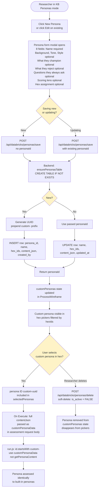
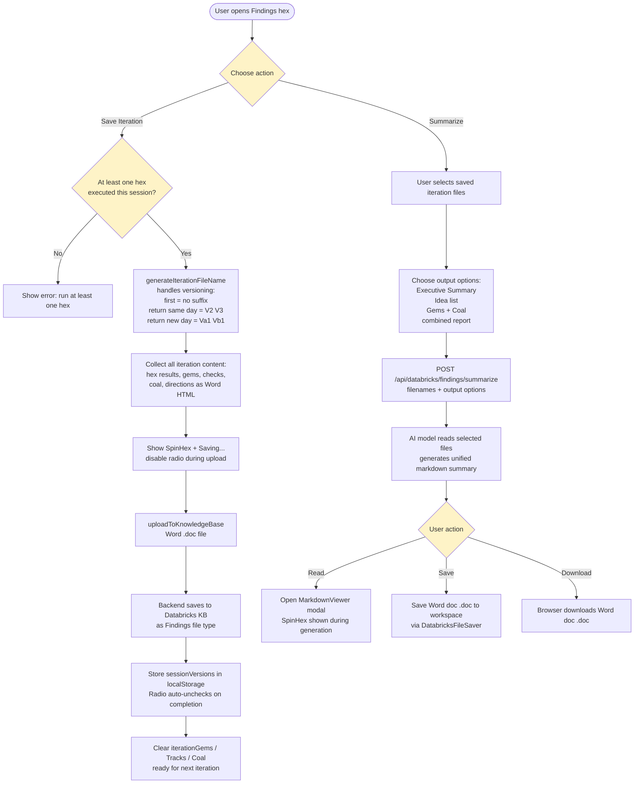
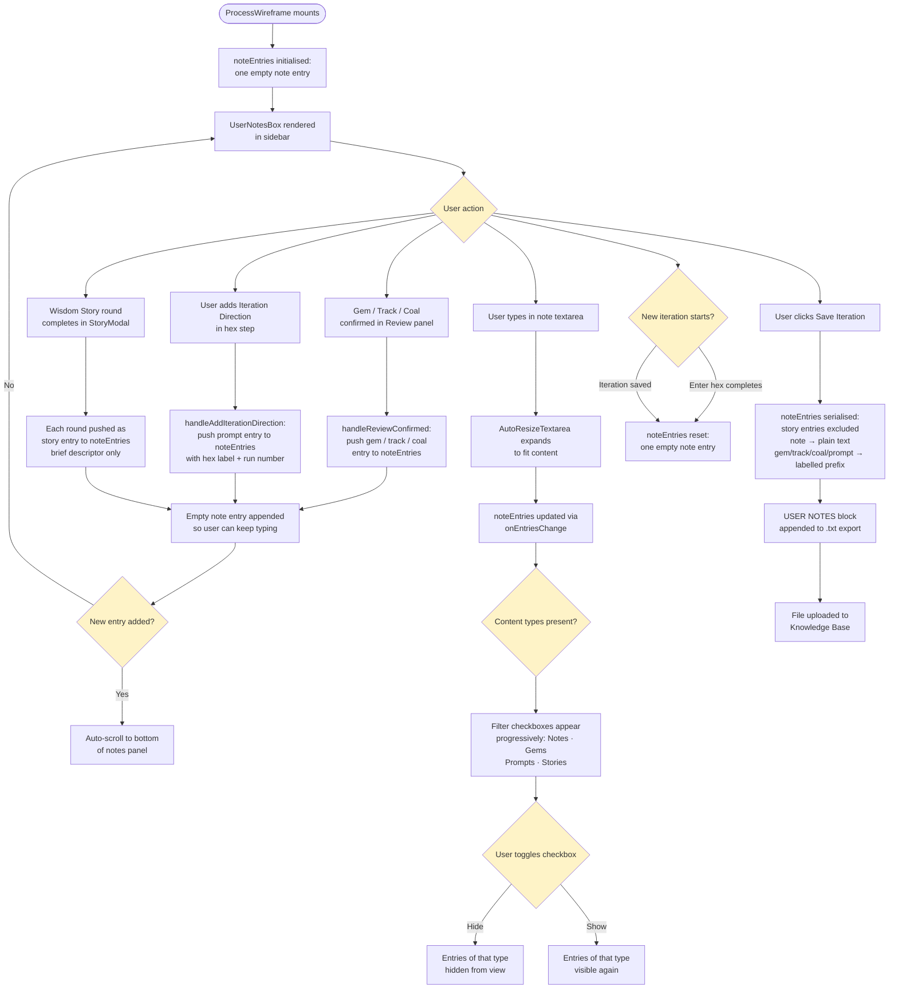
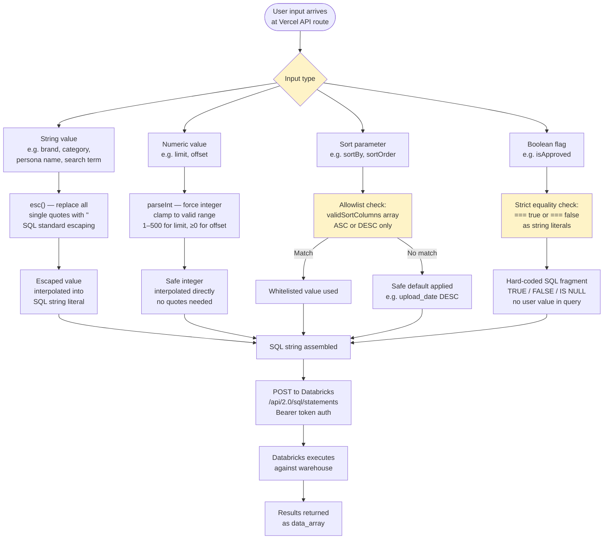
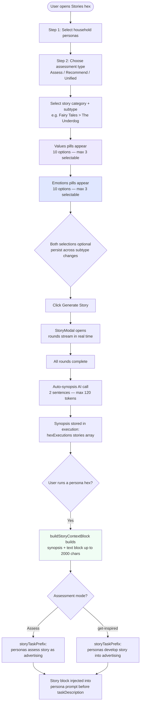

# CoHive — System Flowcharts with Element Descriptions

All significant user flows and data flows in the CoHive application. Each flowchart is followed by a plain-English description of every element.

---

## 1. App Startup & Auth Gate

```mermaid
flowchart TD
    A([User visits app]) --> B{localStorage\ncohive_logged_in?}
    B -- No --> C[Show Login screen]
    B -- Yes --> D{isAuthenticated?\ncheck session + expiry}
    D -- Session valid --> E[Load ProcessWireframe]
    D -- Expired / missing --> F[clearSession]
    F --> C
    C --> G[User enters workspace host\nclicks Sign In]
    G --> H[Initiate OAuth flow]
    H --> I[/oauth/callback route]
    I --> J{Token exchange\nsuccessful?}
    J -- Yes --> K[Set cohive_logged_in = true\nStore DatabricksSession]
    K --> E
    J -- No --> L[Show error message]
    L --> C
    E --> M[2-minute interval\nsession expiry check]
    M --> D
```

| Element | Description |
|---|---|
| User visits app | The starting point — a person navigates to the CoHive URL in their browser, either for the first time or after a refresh. Nothing is rendered until the auth check completes. |
| localStorage cohive_logged_in? | The app's first check. Reads a simple boolean flag from browser local storage. No server call is made at this stage — it is a fast, offline check. |
| Show Login screen | The unauthenticated landing page. Presents a text field for the Databricks workspace host URL and a Sign In button. Nothing else is accessible until login completes. |
| isAuthenticated? check session + expiry | A deeper validation for users who have the flag set. Reads the full DatabricksSession object from localStorage, extracts the expiresAt timestamp, and confirms the token has not yet expired. |
| Load ProcessWireframe | The main application shell loads. All hexes, the Knowledge Base, Findings, and all shared state management become available to the user. |
| clearSession | Removes cohive_databricks_session and cohive_logged_in from localStorage, forcing a clean logged-out state so the user can authenticate again. |
| User enters workspace host, clicks Sign In | The user types their Databricks workspace URL (e.g. adb-1234567890.azuredatabricks.net) and triggers the authentication sequence. |
| Initiate OAuth flow | Builds the full OAuth 2.0 authorization URL and navigates the browser to it — handing control to Databricks. |
| /oauth/callback route | The React Router route registered as the OAuth redirect URI. Databricks sends the browser here after the user grants or denies permission, appending a code and state to the URL. |
| Token exchange successful? | Checks whether the backend API successfully exchanged the authorization code for access and refresh tokens. |
| Set cohive_logged_in = true, Store DatabricksSession | Persists authenticated state in localStorage — both the simple flag for fast future checks and the full session object containing the access token, refresh token, expiry, and workspace host. |
| Show error message | Displays a human-readable message when token exchange fails, e.g. expired code or misconfigured credentials. Returns the user to the Login screen. |
| 2-minute interval session expiry check | A background setInterval that runs while the app is open. Periodically re-runs isAuthenticated and forces logout if the session has expired mid-session without a page refresh. |

---

## 2. Databricks OAuth Round-Trip


| Element | Description |
|---|---|
| User clicks Sign In | The action that triggers the full OAuth 2.0 authorization code flow. |
| Store random state in localStorage | A cryptographically random string is generated and saved to localStorage before leaving the app. This is the CSRF protection token — it must be returned unchanged by Databricks for the flow to proceed. |
| Build authorization URL | Constructs the full URL for the Databricks OIDC authorize endpoint, embedding client_id, redirect_uri, scope (all-apis and offline_access), response_type=code, and the random state. |
| Browser navigates to Databricks OAuth page | The user's browser is redirected to Databricks. The user sees the Databricks consent screen asking them to authorize CoHive's access to their workspace. |
| User grants permission? | The branch point — the user either approves or denies the access request on the Databricks authorization page. |
| OAuth error page | Shown by Databricks if permission is denied. The flow terminates here and the user must restart. |
| Databricks redirects to /oauth/callback?code=X&state=Y | On approval, Databricks sends the browser back to CoHive's registered redirect URI. The URL contains a short-lived authorization code and the state parameter that was sent in the original request. |
| OAuthCallback component extracts code + state | The React component mounted at the /oauth/callback route reads both values from the URL query string. |
| State matches localStorage? | CSRF verification — the returned state is compared against what was saved before the redirect. A mismatch indicates a potential attack and aborts the flow. |
| CSRF error — abort | If state does not match, the authorization code is discarded immediately and the user is shown an error. |
| POST /api/databricks/auth code + workspaceHost | The frontend sends the authorization code to CoHive's own Vercel backend. The client_secret never touches the browser — this server-side step keeps it secure. |
| Backend POST to workspaceHost/oidc/v1/token with client_secret server-side | The Vercel serverless function makes the actual token exchange request to Databricks, including the client_secret stored in environment variables. |
| Token exchange OK? | Databricks either returns tokens (success) or an error (expired code, wrong secret). |
| Return 401 — show error | If the exchange fails, the backend returns 401 and the frontend shows an actionable error message. |
| Return access_token, refresh_token + expires_in | The successful token payload — a bearer token for all future Databricks API calls, a refresh token for renewing sessions, and a lifetime in seconds. |
| Build DatabricksSession expiresAt = now + expires_in | The frontend constructs a session object, converting the relative expires_in value into an absolute Unix timestamp so expiry can be checked at any future moment. |
| Save to localStorage cohive_databricks_session | The full session object is persisted in the browser, surviving page refreshes and tab closures. |
| Clear state from localStorage | The CSRF state token is deleted. It is single-use and keeping it would be a security risk. |
| Redirect to / cohive_logged_in = true | The user is sent back to the app root with the login flag set. ProcessWireframe loads and the session is immediately usable. |

---

## 3. Enter Hex Setup


| Element | Description |
|---|---|
| User opens Enter hex | The first and required hex. Sets up the project context for the entire iteration. All other hexes are locked until Enter is complete. |
| Step 1: Select brand | A dropdown populated from the shared Databricks configuration. The selected brand scopes which KB files, custom project types, and configurations are available for this iteration. |
| Step 2: Select project type | A dropdown combining built-in system project types (Creative Messaging, War Games, Brand Strategy, Manifesto, Big Idea, etc.) with any user-created custom types stored in Databricks. The project type determines which AI prompt template drives every assessment in the iteration. |
| Manifesto project type | A built-in system project type. Requires every generated concept to include two parts: a Story/Script (emotional insight, scenario, brand tone, brand role) and an embedded Product/Brand Claim (product truth or promise). Round 1 generates 2 distinct concepts per persona; Round 2+ debates and scores on Emotional Truth, Brand Fit, Claim Integrity, and Distinctiveness. |
| Custom project type — guided prompt builder | Data Scientists can create custom project types in the Knowledge Base → Workspace tab. A guided form offers 8 optional fields: The Task, What It Is, What It Is Not, How the Session Works, Focus Areas / Evaluation Criteria, Scoring Criteria, Output Format, and Additional Prompt Text. Line-item fields (What It Is, What It Is Not, Focus Areas) are automatically converted to bullet lists. All filled fields are assembled with section headers into the final prompt on save. |
| War Games project type? | A branching decision. War Games is a specialized competitive strategy framework that does not use ideas files — it always generates new strategy. Selecting it skips the filename, ideas source, and ideas upload steps. |
| Step 3: Edit auto-generated filename | A pre-filled text input showing the auto-generated iteration name in the format Brand_ProjectType_YYYY-MM-DD. Users can edit this before saving. The filename persists through all iterations and versioning. |
| Step 4a: Choose ideas source | The working mode declaration. Get Inspired means the AI generates fresh ideas from scratch. Load Current Ideas means the user has existing work they want the AI to assess, compare, and improve. |
| Load Current Ideas selected? | Determines whether the ideas file upload step is shown. Only relevant when the user has existing concepts to evaluate. |
| Step 4b: Upload ideas file | A file picker for the user's existing ideas document. Supports PDF, DOCX, and other text-extractable formats. The file is read as base64 in the browser and held in memory until assessments run — it is not stored in the Knowledge Base. |
| Step 5: Select KB research files | A multi-select checklist of all approved Knowledge Base files available for this brand. These files form the evidence base for all hex assessments throughout the iteration. |
| Select Example files | An optional additional section showing cross-brand reference files — quality and format standards from other brands or categories. If the selected AI model supports document reading, it reads the original binary file directly for format replication. |
| All required fields complete? | The gate check. Brand, project type, and at least one KB file must be selected. Until this gate passes, all other hexes are visually dimmed and unclickable. |
| Other hexes remain locked | The visual state of the hex panel while Enter is incomplete. Each hex tile is greyed out with no click response. |
| All hexes unlock | The full hex panel becomes interactive. The user can now run any hex in any order for the rest of the iteration. |
| requestMode derived | An internal flag set from the ideas source choice: get-inspired or load-ideas. This value flows automatically into every subsequent assessment API call and controls whether the AI generates ideas or evaluates them. |
| selectedResearchFiles + ideaElements available to all hex executions | The Enter selections are stored in ProcessWireframe's top-level state and passed automatically into every assessment modal that opens. The user never needs to re-select files per hex. |

---

## 4. Persona Hex Flow (Luminaries / Consumers / Colleagues / Cultural)


| Element | Description |
|---|---|
| User opens persona hex | One of four discussion-based analysis hexes: Luminaries (advertising legends and thought leaders), Consumers (buyer personas), Colleagues (internal business stakeholders), or Cultural Voices (community representatives). Each has its own persona library but follows the same flow. |
| Step 1 of 2: Persona picker tree | A three-level hierarchical selector. Level 1 groups by broad category (e.g. Era/Approach for Luminaries, Purchase Behaviour for Consumers). Level 2 narrows to a sub-group. Level 3 shows individual named personas with checkboxes. Select All shortcuts operate at each level. |
| Living persona indicator (*) | Personas built solely from a living person's published works are shown with an amber asterisk (*) — e.g. "Seth Godin's Published Works". A disclaimer note appears in the selection summary, and the AI prompt includes a PUBLISHED WORKS PERSONA constraint block preventing fabrication of quotes or statements beyond documented sources. Detection uses the LIVING_PERSONA_IDS Set in personas.ts (client-side) and metadata.living in the persona JSON (server-side). |
| User checks individual personas or uses Select All | Multiple personas can be selected simultaneously. Each selected persona will respond independently in Round 1 and debate the others in subsequent rounds. |
| Custom personas available for this hex? | Checks the customPersonas state loaded from Databricks at startup. Custom personas appear here if their hexIds field includes this hex's ID or is set to 'any'. |
| Show Custom Personas section | Rendered below the built-in persona list. Shows each custom persona's name with a [Custom] badge and a one-line context preview. Uses the same checkbox interaction as built-in personas. |
| Step 2 of 2: Choose assessment type | Three options: Assess (evaluate the current work or KB files), Recommend (evaluate and suggest specific improvements), Unified (synthesize all persona views into one response). Multiple types can be selected together. |
| Single persona selected? | When only one persona is chosen, Unified is meaningless — there is nothing to unify. The option is greyed out and its tooltip explains why. |
| Unified disabled — choose Assess or Recommend | The user is guided to select either Assess or Recommend when running a solo persona. |
| Assess / Recommend / Unified all available | With two or more personas selected, all three assessment modes are available. Unified can be combined with Assess or Recommend to produce both individual voices and a synthesis. |
| Prior executions exist in this or other persona hex? | Checks whether this hex or any other persona hex has results from earlier in this iteration. If so, the user may want to bring that prior context into the new session. |
| Prior Persona modal | A three-option dialog that appears when prior results exist. Include full prior context: prior persona responses join the new session and can be referenced and challenged. Include summary only: a brief digest of prior rounds is shared as background. Start fresh: no prior context is included. |
| handleExecute called | The internal function that packages all selections — persona IDs, assessment type, and any user-typed assessment text — into the props needed to open the assessment modal. |
| Assessment modal opens with full context | The modal launches pre-loaded with brand, project type, KB file names, request mode, idea elements, model endpoint, and all prior hex executions. The user does not re-enter any of this information. |
| User sets KB mode + scope | Two final configuration choices before the AI runs. KB mode controls how strictly the AI is limited to KB files (hard-forbidden, strong-preference, or equal-weight with general knowledge). Scope controls the breadth of evidence (brand-only, category-level, or broad market). |
| POST /api/databricks/assessment/run | The assessment request fires to the Vercel backend. Initiates the full multi-round AI pipeline. factCheckerModelEndpoint is passed separately so the fact-checker step uses a different, independently configurable model (default: GPT-4o Mini) from the main assessment model. |
| SSE stream opens — rounds arrive in real-time | Server-Sent Events stream starts immediately. The modal displays each round as it is generated — Moderator Opening, Round 1, Debate rounds, Fact-Checker, Synthesis — without waiting for the full response to complete. |
| Fact-Checker model | A separate AI model reviews the completed assessment for factual accuracy. Configured independently per hex in Model Templates → Fact Checking row. Defaults to GPT-4o Mini (a different model from the main assessment model). Stories hex does not include a fact-checker step. |
| Results displayed in modal — user can save Gems / Tracks / Coal | The complete assessment is readable in the modal. Users can highlight any text to save it as a directional signal: Gem (keep going this way), Track (note of interest), Coal (avoid this direction). |

---

## 5. Grade Hex Flow

```mermaid
flowchart TD
    A([User opens Grade hex]) --> B[Step 1: Ideas extracted automatically\nfrom all prior hex discussions]
    B --> C[Ideas displayed as checkboxes\nall checked by default]
    C --> D[User unchecks to exclude\nor types to add manually]
    D --> E[Zappi Questions toggle in Step 1\ndefault OFF]
    E --> F{Include Zappi\nQuestions?}
    F -- Yes → ideas optional --> G{At least 1 idea\nOR Zappi enabled?}
    F -- No → ideas required --> G
    G -- No --> D
    G -- Yes --> H[Step 2: Segment picker\nLifestyle / Demographic / Psychographic hierarchy]
    H --> I[User selects target segments\npopulation % shown per segment]
    I --> J{At least 1 segment\nselected?}
    J -- No --> I
    J -- Yes --> K[Step 3: Choose scoring scale\n1-5 written / 1-5 scores only\n1-10 written / 1-10 scores only\nWritten only]
    K --> L[Run Scoring clicked\ngradeAssessment encoded:\nGRADE_SCALE + GRADE_IDEAS\n+ optional ZAPPI_QUESTIONS:true]
    L --> M[Full-screen loading hex\nwhile Databricks processes]
    M --> N[POST /api/databricks/assessment/run\nassessmentTypes = grade\nselectedPersonas = segment IDs]
    N --> O[buildGradeScoringPrompt called\ntopic-first format instructions]
    O --> P[Each segment scores each idea\nfrom segment persona perspective]
    P --> Q[Score grid returned\nideas × segments with populations]
    Q --> R[Results: TOPIC heading per idea\nthen per-segment scores below]
    R --> S{Written assessments\nrequested?}
    S -- Yes --> T[One paragraph per idea × segment pair]
    S -- No --> U
    T --> U[Results appended to iteration file\nGrade: Score Grid + Grade: Written Assessments]

    style F fill:#fef3c7
    style G fill:#fef3c7
    style J fill:#fef3c7
    style S fill:#fef3c7
```



| Element | Description |
|---|---|
| User opens Grade hex | The scoring hex. Used after running other hexes to evaluate the ideas and strategies that emerged, against specific consumer segments. Produces a score grid rather than a dialogue. |
| Step 1: Ideas extracted automatically | On open, ProcessWireframe scans all prior hex discussion results using an AI extraction call and pulls out idea candidates — strategies, creative concepts, and recommendations that emerged from the iteration so far. |
| Ideas displayed as checkboxes — all checked by default | Every extracted idea is pre-selected. The user reviews the list and unchecks any ideas that are incomplete, tangential, or not ready for scoring. |
| User unchecks to exclude or types to add manually | Full editorial control. Ideas can be deselected from the extracted list, and entirely new ideas not mentioned in any hex discussion can be typed in and added manually. |
| Zappi Questions toggle in Step 1 — default OFF | The Zappi toggle lives in Step 1 (alongside idea selection), not Step 3. This placement allows the validation logic to know whether ideas are required before the user advances. |
| Include Zappi Questions? | Two independent Zappi sets, both optional and default OFF. Set 1: 7 standardised concept-testing dimensions (Brand Fit, Standout, Emotion, Relevance, Understanding, Purchase Intent, Brand Appeal) scored 1–5. Set 2: 6 brand & creative dimensions (Clarity, Product Anchoring, Emotional Resonance, Distinctiveness, Sensory Impact, Authenticity) scored 0–5, each with guiding sub-questions; the brand name is interpolated into Product Anchoring and Distinctiveness sub-questions at prompt-build time. Either set alone (or both together) makes ideas optional — Zappi-only mode is active if at least one set is enabled with no ideas selected. |
| At least 1 idea OR Zappi enabled? | Validation gate. If Zappi is OFF, at least one idea must be selected. If Zappi is ON, the flow proceeds even with zero ideas, producing a segment-only Zappi assessment. |
| Step 2: Segment picker — Lifestyle / Demographic / Psychographic hierarchy | A three-category segment tree. Lifestyle covers Activities, Consumption patterns, and Life Stage. Demographic covers Age Groups, Income levels, Geography, and Household composition. Psychographic covers Values, Personality types, and Attitudes. Each leaf node is a scorable consumer segment. |
| User selects target segments — population % shown | Each leaf segment shows its estimated US market population percentage where available. This helps users understand the scale of the audience they are scoring against and appears as column headers in the output score grid. |
| At least 1 segment selected? | Validation gate — scoring requires at least one target segment. |
| Step 3: Choose scoring scale | Five options that control the output format: 1–5 with written rationale per score cell, 1–5 numeric scores only, 1–10 with written rationale, 1–10 numeric scores only, or written assessments with no numeric scores at all. |
| Run Scoring clicked — gradeAssessment encoded | The assessment parameters are packed into a structured marker string: [GRADE_SCALE:value] records the chosen scale, [GRADE_IDEAS:idea1\|\|idea2] lists all ideas pipe-separated, and [ZAPPI_QUESTIONS:true] is appended when the toggle is on. The ideas parser strips the Zappi marker before extracting the ideas list. |
| Full-screen loading hex while Databricks processes | A full-viewport overlay with a large rotating SpinHex (w-32 h-32) covers the screen while the scoring request is in flight, replacing the grade section until results return. |
| POST /api/databricks/assessment/run | The same assessment endpoint used by persona hexes, called with assessmentTypes=['grade'] and selectedPersonas set to the chosen segment IDs. |
| buildGradeScoringPrompt called — topic-first format instructions | The gradeExtraction.ts function builds the scoring prompt with topic-first output instructions: the AI must output TOPIC: [idea] as a heading, then each segment's response below it, so all segments for one idea are grouped together. |
| Each segment scores each idea from segment persona perspective | Each selected segment acts as a persona evaluating the ideas as a real consumer in that profile would respond to them. This produces the full ideas × segments matrix. |
| Score grid returned — ideas × segments with populations | The primary output. A table with ideas as rows and consumer segments as column headers. Population percentages appear in column headers where data was available. |
| Results: TOPIC heading per idea then per-segment scores below | The written output is structured topic-first — the idea phrase appears as a bold heading (TOPIC:), followed by each segment's score and assessment indented beneath. This makes it easy to compare all segment reactions to one idea before moving to the next. |
| Written assessments requested? | Determined by the chosen scoring scale. Scales that include 'written' add a prose paragraph per cell; scores-only scales return just numbers. |
| One paragraph per idea × segment pair | When written assessments are included, a short explanatory paragraph accompanies each score — explaining the specific reasons that segment would or would not respond positively to that idea. |
| Results appended to iteration file | The score grid and written assessments are saved to the iteration file as two clearly labelled sections — [Grade: Score Grid] and [Grade: Written Assessments] — so each can be independently selected when building Findings summaries. |

---

## 6. Assessment Pipeline (run.js)


| Element | Description |
|---|---|
| POST /api/databricks/assessment/run | The single entry point for every AI assessment in CoHive. Called by AssessmentModal with the full session context. One endpoint handles all hex types — persona hexes, Grade, Competitors, and War Games. |
| Parse markers from userSolution | The backend scans the user solution text for special encoded markers before using it in prompts. [PRIOR_PERSONAS:...] carries names from a previous run to include as context. [PRIOR_SUMMARY:...] carries a digest of prior rounds. [WAR_GAMES_COMPETITOR:...] names the competitor brand. [ZAPPI_QUESTIONS:true] enables the concept-testing question block. All markers are stripped before the cleaned text is used. |
| Resolve credentials — env vars preferred over OAuth token | Credential hierarchy: server-side environment variables (DATABRICKS_TOKEN, DATABRICKS_HOST) are used whenever present, as they represent stable service principal credentials. OAuth tokens passed from the browser are used only as fallback for user-passthrough OAuth mode. |
| Fetch KB file content from Databricks volumes | For each selected KB file, the backend queries the file_metadata table for the file path, then downloads the content. If a processed _txt version exists it is used in preference to the original — faster and already extracted. Content is capped at 80KB per file to control prompt size. |
| Fetch prior gems for this brand + hex | Queries the Databricks gems table to find text the user previously marked as exemplary for this brand and hex in past sessions. These examples are injected into every persona prompt as positive calibration signals showing what good output looks like. |
| Build combinedSignals block | Assembles all directional context into a single prompt block: KB gems from previous sessions, iteration signals from this session's GemCheckCoalReviewPanel (gems ranked by importance, tracks to explore, coal to avoid), any prior persona context the user chose to include, and mid-iteration direction notes added by the user. |
| Build iterationContextBlock | Summarises what the other hexes have already produced in this iteration — truncated to 500 characters per hex. Personas use this to build forward rather than repeat what earlier hexes established. |
| Resolve projectTypePrompt | Determines which AI prompt template drives the assessment. Priority order: user-defined prompts from the project_type_configs Databricks table, then system built-in prompts (one for each of the 20+ system project types), then a generic analytical fallback. |
| Load persona data | Maps each selected persona ID to its full profile data. IDs beginning with custom- are resolved from the customPersonaData object passed in the request body. Built-in IDs call getPersonaContent() to retrieve the full persona including voice characteristics, evaluation criteria, psychographics, and scoring rubric. |
| Shuffle persona order | Randomises the sequence in which personas appear in each round to prevent the same persona always anchoring the discussion by responding first. |
| Setup SSE headers — begin streaming | Configures the HTTP response as a Server-Sent Events stream with Content-Type: text/event-stream. Each completed round is sent to the browser immediately as it finishes, rather than buffering the full response. |
| Round 0: Moderator Opening | The AI acts as a neutral moderator framing the session. The prompt asks it to produce: a specific session objective for this brand and task, a description of what good output looks like, rules of engagement (KB mode, challenge requirement, citation rules), and three sharp questions the session must answer by the end. |
| Stream round 0 to frontend | The moderator opening is sent as the first SSE event. Users see it before any persona has responded — it sets expectations for the session. |
| Round 1: Parallel persona fire — Promise.all | All selected personas fire simultaneously via JavaScript's Promise.all(). This parallel execution is the key architectural choice — it cuts wall-clock time dramatically compared to sequential persona calls. |
| Each persona: identity block + KB context + task description | Each persona's prompt is constructed from their unique character (name, voice, beliefs, what they champion, what they attack, evaluation questions) combined with the shared KB content, task description, KB mode instructions, and all directional signals. |
| Stream round 1 to frontend | All Round 1 responses are bundled and sent as a single SSE event once all Promise.all promises have resolved. |
| numDebateRounds > 0 AND more than 1 persona AND not War Games? | Three conditions must all be true for debate rounds to run. The configured number of debate rounds must be positive. There must be at least two personas — a single voice has no one to debate. And the project type must not be War Games, which uses a sequential framework instead of free debate. |
| Moderator Recap | Between each debate round, the moderator reviews the full prior transcript and produces a brief identifying: one blunt sentence per persona summarising their contribution, the sharpest disagreements that emerged, claims that went unchallenged and deserve scrutiny, and a specific provocation for the next round. |
| Debate round: re-shuffled order | The persona order is reshuffled again for each debate round to prevent anchoring. Each persona reads the full prior transcript and must directly reference at least two other personas by name — either extending their point with evidence or challenging it. They must identify a blind spot and direct a probing question at a specific named peer. |
| Stream debate round to frontend | Debate round content (the moderator recap plus all persona responses) is sent as a single SSE event when all parallel calls resolve. |
| More debate rounds? | Controls the loop — runs until the configured numDebateRounds is exhausted. Default is 1 debate round; maximum is 3. |
| Fact-Checker round | A specialised AI pass that reads the entire transcript and audits every [Source: filename.ext] citation. It verifies each filename against the list of authorised KB files, flags invented or mistyped filenames, and notes any significant claims made without any citation. |
| Stream fact-checker to frontend | The citation audit is streamed before the final synthesis so users can see it as part of the live session. |
| Moderator Synthesis | The closing moderator pass reads the complete transcript and issues a decisive recommendation. It identifies consensus, dissenting views worth noting, open questions the session could not resolve, and specific prioritised actions. For Big Idea projects it names frontrunner ideas. For load-ideas mode it delivers a final verdict on the assessed element. |
| Stream synthesis to frontend | The synthesis is streamed as the final substantive round event. |
| Neutral Summarizer | A separate, clean AI call that has never seen the system prompt, KB files, or persona identities. It summarises only what the transcript explicitly says — no interpretation or additional judgment. This clean summary is stored and used as the iterationContextBlock in subsequent hex executions, keeping later prompts from growing too large. |
| Extract cited filenames — increment citation_count | Scans all round content for [Source: filename.ext] patterns, extracts unique file names, matches them to fileIds in the KB, and fires background UPDATE SQL queries to increment each cited file's citation_count in file_metadata. Helps surface frequently-cited files. |
| logAssessment to activity_log | Writes a structured completion record to the Databricks activity_log table covering hex, brand, project type, personas used, model endpoint, round count, citation count, and wall-clock duration. |
| Stream complete event | The final SSE event signalling the stream is finished. Carries the full completion metadata: list of cited files, the neutral summary, persona order used, request mode, KB mode, scope, and duration in milliseconds. |

---

## 7. Knowledge Base: Upload & Process Flow


| Element | Description |
|---|---|
| User in KB Synthesis mode | The researcher has opened the Knowledge Base hex and selected the Synthesis tab, which shows the upload interface and the file management list. |
| Click Upload — file picker opens | Triggers the browser's native file picker dialog. |
| User selects file up to 37MB | Supported types include PDF, DOCX, PPTX, plain text, CSV, Excel, images (JPEG, PNG), and audio (WebM, MP3, WAV, OGG, M4A). The 37MB limit is enforced by the upload handler. |
| Frontend reads file — converts to base64 | The browser reads the file using the FileReader API and encodes it as a base64 string for transmission over JSON. |
| POST /api/databricks/knowledge-base/upload | Sends the encoded file to the Vercel upload handler with metadata: file name, type (Research, Wisdom, Findings, or Example), scope (brand, category, or general), brand, and project type. |
| Backend: insert file_metadata row | Creates a record in the knowledge_base SQL table. isApproved is false and cleaningStatus is uncleaned — the file exists in the system but cannot yet be selected for assessments. |
| Upload file to Databricks volumes | The actual file bytes are written to permanent cloud storage at the configured volume path. |
| Return fileId to frontend | The generated identifier is returned so the frontend can track this file through processing and approval. |
| File appears in Pending Processing list | The newly uploaded file appears in the researcher's processing queue in the KB interface. |
| Researcher clicks Process | The researcher selects one or more files from the pending queue and triggers the text extraction and metadata generation pipeline. |
| POST /api/databricks/knowledge-base/process with fileId | Calls the processing handler on the Vercel backend. |
| Download file from volumes | The process handler fetches the raw file bytes from Databricks volume storage. |
| File type? | The file extension determines which extraction strategy is used. |
| Read as UTF-8 | Plain text files (txt, md, csv) are read directly — no library needed. |
| Extract via pdf-parse | PDF files are processed by the pdf-parse library to extract all text content. |
| Extract via mammoth | Word documents are processed by the mammoth library, which produces clean text without formatting artefacts. |
| Extract via xlsx library | Excel spreadsheets are processed by the xlsx library. Each sheet is converted to CSV and concatenated. |
| Vision model describes image | Images are passed to an AI vision model which generates a text description of the visual content — making images searchable and usable in assessments. |
| POST to OpenAI Whisper-1 | Audio files are sent to OpenAI's Whisper-1 transcription API using the server-side OPENAI_API_KEY. The transcript is prefixed with [Recorded: date] using the file's upload_date metadata. |
| Attempt UTF-8 read | For unrecognised extensions, the handler attempts to read raw bytes as UTF-8. If it fails, an error placeholder is stored in place of extracted content. |
| Text capped at 200KB | All extracted text is truncated to 200,000 characters before further processing. This prevents token overflow in the AI metadata call and in future assessments that load the file. |
| AI generates: summary, tags, suggestedBrand, suggestedProjectTypes | The extracted text is sent to the AI model which generates a plain English summary, keyword tags for search, the most likely brand this content relates to, and the project types it is most relevant to. These are stored in the file_metadata row. |
| Upload _txt version to volumes | A plain text version of the extracted content is uploaded as a new file named {original_name}_txt.txt. Assessment calls prefer this version for speed and reliability. |
| Insert _txt file_metadata row | A new metadata row is created for the _txt file with fileId = original_fileId + '_txt'. Assessment handlers always check for the _txt version first before falling back to the original. |
| Update original: cleaningStatus = processed | The original file's status is updated to 'processed'. It is now in the approval queue but still not visible to non-researcher users. |
| File appears in Pending Approval | The file moves to the approval section in the KB interface where Research Leaders can review it. |
| Research Leader approves? | The human approval gate. A Research Leader reviews the extracted content, checks the AI-generated metadata, and decides whether the file is ready for use in assessments. |
| isApproved = true — approvalDate = now | The file is marked approved with a timestamp and the approver's email. |
| File available in hex pickers for all users | Once approved, the file appears in the KB file selector on every hex for all workspace users. |
| File stays unapproved — not visible in hexes | If not approved or left in the queue, the file remains invisible to non-researcher users and cannot be selected for assessments. |

---

## 8. Custom Personas: Create / Edit / Delete



| Element | Description |
|---|---|
| Researcher in KB Personas mode | Only users with a Researcher role (research-analyst, research-leader, data-scientist, administrator) can access the Personas tab in the KB hex. |
| Click New Persona or click Edit on existing | Two entry points to the same form. New starts with all fields blank. Edit pre-populates all fields from the saved persona data. |
| Persona form modal — 8 fields | The creation and editing form. Name is the only required field. All others are labelled optional and can be left blank: Background (who this person is and their professional context), Tone (how they communicate), Style (their rhetorical approach), What they champion (what they praise and value in work), What they reject (what they criticise and argue against), Questions they always ask (their signature evaluation questions that the AI will always address), Scoring lens (how they evaluate and score ideas), Hex assignment (which hexes will show this persona — all hexes or specific ones). |
| Saving new or updating? | Determines the database operation. A form submitted without a personaId creates a new record. A form submitted with an existing personaId updates that record. |
| POST /api/databricks/personas/save — no personaId | Creates a new persona record. |
| POST /api/databricks/personas/save — with existing personaId | Updates the named fields of an existing persona while preserving its ID, creator, and creation date. |
| Backend: ensurePersonasTable | Every call to the personas API begins with CREATE TABLE IF NOT EXISTS. This is idempotent and safe to run on every request — it ensures the table exists on first use without requiring manual database setup. |
| New? | Determines whether to generate a fresh ID or reuse the existing one. |
| Generate UUID — prepend custom- prefix | A random UUID is generated for each new persona. The custom- prefix distinguishes custom personas from built-in persona IDs everywhere in the codebase and is used to route loading in run.js. |
| Use passed personaId | For updates, the existing ID is reused — preserving the persona's identity across all edits. |
| INSERT row | Creates the full database record: persona_id, name, hex_ids (either 'any' or a comma-separated list of hex IDs), content_json (all form fields serialised as a JSON object matching the built-in persona schema), created_by (the researcher's email), created_at, is_active=true. |
| UPDATE row | Updates name, hex_ids, content_json, and updated_at. The persona_id, is_active, and created_by fields are not changed. |
| Return personaId | The ID is returned to the frontend so the new or updated persona can be immediately tracked in state. |
| customPersonas state updated in ProcessWireframe | The master list of custom personas held at the top of the app is refreshed. The change propagates to all hex pickers immediately without a page reload. |
| Custom persona visible in hex pickers filtered by hexIds | Each hex renders only the custom personas relevant to it — those whose hex_ids field contains 'any' or this hex's specific ID. They appear with a [Custom] badge below the built-in persona list. |
| User selects custom persona in hex? | The branching point — the custom persona can either be selected for use in an assessment or deleted by the researcher. |
| persona ID custom-uuid included in selectedPersonas | The custom persona's ID joins the same array as built-in persona IDs. No special handling is needed at the selection level. |
| On Execute: full contentJson passed as customPersonaData | When an assessment fires, the complete persona profile JSON is sent in the request body rather than relying on a database lookup during the assessment call. This avoids an extra DB round-trip in the critical path. |
| run.js: id.startsWith custom- — use customPersonaData | The assessment backend detects the custom- prefix and reads from the passed data object instead of calling getPersonaContent(). |
| Persona assessed identically to built-in personas | Once loaded, buildPersonaIdentityBlock() processes the custom persona's contentJson exactly the same way as any built-in persona. Custom personas participate fully in all rounds with no difference in treatment. |
| POST /api/databricks/personas/delete — soft-delete: is_active = FALSE | Deletion sets is_active to false rather than removing the row. The record is preserved for audit purposes. The persona immediately disappears from all pickers in the current session. |
| Persona removed from customPersonas state — disappears from pickers | The frontend state is updated synchronously. The persona vanishes from all hex pickers without requiring a page reload. |

---

## 9. Findings Hex: Save & Summarize



| Element | Description |
|---|---|
| User opens Findings hex | The final hex in the workflow. Used to preserve the iteration's work and optionally generate cross-iteration reports. |
| Choose action | Two distinct modes available in the Findings hex. Save Iteration persists the current session's results. Summarize generates an AI report across one or more previously saved iterations. |
| At least one hex executed this session? | Validation. There must be something worth saving. If the user has not run any hex in this session, saving is blocked with a clear error. |
| Show error: run at least one hex | Guides the user back to generate content before attempting to save. |
| generateIterationFileName — handles versioning | Smart filename generation. The first save uses the base name (Brand_ProjectType_YYYY-MM-DD). A second save on the same day appends V2, then V3. If the user returns on a different day to the same project context, the versioning branches: Va1, Vb1, and so on. This preserves the full history of an iterative project. |
| Collect all iteration content | Everything from the session is assembled into a Word-compatible HTML document using the textToWordHtml() utility: all hex discussion results, saved gems, checked items, coal (things to avoid), grade scores, and user notes. |
| Show SpinHex + Saving... / disable radio during upload | While the upload is in progress, isSavingIteration=true disables the radio button and replaces its label with a SpinHex spinner + "Saving..." text. This prevents double-submissions. |
| uploadToKnowledgeBase Word .doc file | The assembled .doc file (MIME: application/msword) is uploaded to the Databricks Knowledge Base as a Findings file with iterationType: "iteration". |
| Backend saves to Databricks KB as Findings file type | The file is written to the Databricks workspace and indexed in the KB metadata table with fileType = "Findings". This makes it available in My Files and selectable for Summarize. |
| Store sessionVersions in localStorage / Radio auto-unchecks on completion | On successful upload, handleResponseChange(idx, "") resets the radio to blank. isSavingIteration resets in a finally block so it always clears even on error. sessionVersions is updated to track the version suffix for the next save. |
| Clear iterationGems / Tracks / Coal — ready for next iteration | Resets all directional signals in ProcessWireframe state. The next iteration begins with a clean slate of no pre-existing signals. |
| User selects saved iteration files | In Summarize mode, the user browses previously saved iterations and selects one or more to synthesize across. |
| Choose output options | Configuration for the summary output: Executive Summary (high-level strategic overview), Idea list (all ideas that emerged), Gems and Coal (directional signals), or a combined report including all sections. |
| POST /api/databricks/findings/summarize | The selected file names and output options are sent to the Vercel backend. |
| AI model reads selected files — generates unified summary | The AI reads all selected iteration files in full and synthesizes them into a structured summary document according to the chosen output options. |
| User action | Three ways to use the generated summary. |
| Open MarkdownViewer modal | The Read option fires generateSummary(); a SpinHex appears next to the "Read" label (isGeneratingSummary state) while the API call is in progress. On completion the result renders in a MarkdownViewer modal. |
| Save Word doc .doc to workspace via DatabricksFileSaver | The summary is converted to Word-compatible HTML via textToWordHtml(), named with a .doc extension, and saved to Databricks via DatabricksFileSaver. |
| Browser downloads Word doc .doc | The Download option calls downloadWordDoc(), converting the summary to Office-namespace HTML and triggering a browser download as a .doc file — opens correctly in Word and Google Docs. |

---

## 10. Wisdom Hex: All Input Methods


| Element | Description |
|---|---|
| User opens Wisdom hex | The knowledge contribution hex. Any authenticated user can add their expert knowledge, field observations, or strategic insights to the Knowledge Base. Designed for capturing tacit knowledge that is not already in a document. |
| Choose input method | Six capture methods covering different scenarios — from a quick typed note to a structured multi-turn interview. |
| Text | Labelled "Text / dictation, unlimited time". For typing an insight directly with no time limit. A microphone icon enables voice-to-text dictation into the textarea. |
| Voice | Labelled "Voice / audio - 90 seconds". For capturing a spoken insight as an audio file (up to 90 seconds). The recording is transcribed by Whisper-1 when a Research Leader processes the file. |
| Photo | For capturing physical materials — whiteboard notes, printed documents, visual references. |
| Video | For capturing presentations, walkthroughs, or demonstrations. |
| File | For uploading an existing document. Identical to KB upload but tagged as Wisdom input type. |
| Interview | The richest method. An AI interviewer draws out structured knowledge through a guided multi-turn conversation. |
| Type insight in textarea — optional voice-to-text mic | The user types their insight. A microphone icon enables voice dictation into the text field for hands-free input. |
| Click Save — convert text to .txt file | The typed content is packaged as a plain text file and passed to the upload pipeline. |
| Click Start Recording — browser requests microphone | The browser's getUserMedia API is called. The user must grant microphone access before recording begins. |
| Permission granted? | Microphone access is either approved (recording begins) or denied (error message shown). |
| Show mic error | A message explaining that microphone access is required and guiding the user to adjust their browser permissions. |
| MediaRecorder captures WebM audio | The browser's MediaRecorder API records audio in WebM format — supported across all modern browsers. |
| User speaks → Stop Recording | The user records their insight verbally, then clicks Stop. The recording is complete. |
| Audio blob saved as .webm file | The recorded audio is packaged as a File object ready for upload. The processing pipeline will send it to Whisper-1 for transcription. |
| Capture or Upload? | For photos, the user chooses between using their device camera to take a new photo, or uploading an existing image from their device. |
| requestCameraAccess — capture JPEG frame from video | The camera feed is requested, shown in the UI, and a snapshot is taken as a JPEG image when the user clicks capture. |
| File picker JPEG / PNG | Standard file upload for existing photo files. |
| MediaRecorder captures video — WebM container | Similar to audio recording but captures both video and audio tracks together in a WebM file. |
| Stop → video file saved | The video recording is ended and the resulting WebM file is ready for upload and processing. |
| File picker — any format up to 37MB | Standard file upload. The same extraction pipeline used for KB Synthesis handles the content based on file type. |
| AIConversation created — flexible interview system prompt | An AIConversation class instance is initialised with a system prompt that frames the AI as a professional interviewer — asking focused follow-up questions to draw out specificity, context, and depth. |
| User types topic — AI asks opening question | The user specifies what they want to share wisdom about. The AI responds with a structured opening question to begin the interview. |
| Multi-turn Q&A — AI prompts for depth | The conversation continues with the AI asking follow-up questions based on previous answers — probing for examples, caveats, and implications. |
| User ends interview? | The user signals they are finished. The interview can run for as many turns as needed. |
| AI generates structured summary | Once the interview concludes, the AI synthesises the full conversation transcript into a well-structured document capturing the key insights in an organised format. |
| User edits summary if desired | The generated summary is shown in an editable text area. The user can refine wording, add detail, or remove anything before saving. |
| Save summary as file | The final edited summary is uploaded to the Knowledge Base as a document. |
| uploadToKnowledgeBase — fileType=Wisdom, scope=brand/category/general | All six input methods converge here. The content is uploaded with Wisdom as the file type and the user's chosen scope: brand-specific insight, category-level observation, or general industry knowledge. |
| File pending processing — Research Leader must Process then Approve | Wisdom files follow the same processing and approval pipeline as all other KB files. They are not immediately usable in hex assessments until a Research Leader processes and approves them. |
| Video submission note | For brand video footage (events, in-use demonstrations), users are directed to email help@cohivesolutions.com or share via a link with filename and address/URL. This note appears below all input method options in the Wisdom hex. |

---

## 11. AI Help Widget Flow


| Element | Description |
|---|---|
| Any authenticated page | The AI Help Widget is always present on every page of the app once logged in. It does not require the user to navigate anywhere — help is available in context wherever they are. |
| AIHelpWidget mounted with context props | The widget receives live context from its parent component: which hex is active, its display label, the user's role, which step within the hex they are on, which files are currently selected, which KB mode is active, and which wisdom input method is in use. |
| Context banner built | A compact one-line display assembled from the received props, e.g. "Nike · Creative Messaging · Step 2/3 · 3 KB files". The user can see at a glance that the widget knows exactly where they are in the app. |
| Welcome message shown — hint to type help | The initial greeting references the current page by name and offers a prompt to type 'help' for guided assistance. |
| User input | The ongoing interaction loop. The user can type a question, click a chip, or the widget can react automatically to navigation events. |
| types help | The shortcut path. Typing 'help' triggers the guided step-by-step flow rather than a free-form AI query. |
| Identify current hex — look up HELP_MANUAL entry | The widget maps the active hex ID to its entry in the HELP_MANUAL dictionary, which contains a goal description and a numbered list of steps for that hex. |
| Show guess chip: Yes walk me through it / No something else | Before launching into guidance, the widget confirms its interpretation of what the user is trying to do. This avoids giving step-by-step instructions for the wrong task. |
| User chip | The user either confirms the widget's guess or redirects it. |
| Show numbered step-by-step guide for current hex | The HELP_MANUAL steps are displayed as a numbered list with circular numbered badges — the same format as the app's step indicators. |
| Show all hex chips — user picks which flow to learn | If the user says "no, something else," every available help topic is shown as a selectable chip. The user clicks the one they actually need guidance on. |
| Append to conversationHistory — call executeAIPrompt | For freeform questions, the message is added to the conversation history array and sent to the AI via executeAIPrompt(). |
| systemPrompt: current page state + full HELP_MANUAL + Hex documentation | The AI's system prompt is dynamically assembled on every request to include the precise current state of the page, the complete help manual for all hexes, and detailed documentation for the active hex. This ensures answers are specific and accurate to the user's exact context. |
| AI responds with contextual guidance | The AI model returns a response informed by exactly where the user is in the app and what they are trying to accomplish. |
| Response added to messages — conversationHistory updated | The AI's response is displayed in the chat interface and the conversation history array grows, enabling coherent multi-turn follow-up questions. |
| Nudge message: I see you switched to X | When the user navigates to a different hex, the widget automatically sends a short notice that it has detected the change and is ready to help with the new context. |
| Nudge message: Switched to Personas mode | When the user switches tabs within the KB hex (e.g. from Synthesis to Personas), the widget acknowledges the mode change and offers relevant help. |

---

## 12. Iteration Signals: Gems / Tracks / Coal


| Element | Description |
|---|---|
| Assessment modal open — results streaming in | The assessment is running and persona responses are appearing in real time via the SSE stream. The user is reading through the results as each round completes. |
| User highlights text in any round result | Any text in the streaming results can be selected. A signal-saving button appears at the selection point. |
| Signal type | Three distinct signal types representing different levels of enthusiasm and intent. |
| Gem: really like this | The strongest positive signal. The user loves this direction, idea, or phrasing and wants the AI to keep moving this way in future hexes and sessions. |
| Save gem modal: confirm text + optional note | A small confirmation modal pre-fills the highlighted text. The user can add a contextual note explaining why they liked it, then saves. |
| saveGem called — POST /api/databricks/gems/save | The gem is persisted to Databricks with brand, project type, hex ID, gem text, file name reference, and the user's email. These are retrieved automatically in future sessions for the same brand and hex. |
| Gem stored in Databricks gems table | Permanent storage. Gems from previous sessions are fetched at the start of every assessment call and injected as positive examples. |
| iterationGems state updated in AssessmentModal → bubbled to ProcessWireframe | The gem is added immediately to the in-memory iteration state so it is available for the remaining hexes in the current session without a database fetch. |
| Track: interested | A neutral signal of interest. The user wants to keep this in mind but is not as certain as a gem. Saved to in-memory state only — not persisted to the database. |
| Coal: avoid this | A negative signal. The user explicitly does not want the AI to go in this direction. Saved to in-memory state and actively steers subsequent persona prompts away from this territory. |
| GemCheckCoalReviewPanel — shown post-assessment | A review interface that appears after each assessment. The user sees all signals accumulated so far in the iteration. They can confirm which signals to carry forward and drag to rank them in order of importance. |
| Confirmed signals stored in ranked order | The user's rankings are preserved. Higher-ranked signals receive more prominence in the prompt injections. |
| Next hex execution triggered | When the user runs another hex, all confirmed ranked signals are included in the assessment context. |
| buildIterationSignalsBlock | The function that assembles all three signal types into a structured prompt section with clear headings and numbered rankings. |
| Injected into every persona prompt and Moderator opening | Every persona in every subsequent round receives the signals block as part of their context — it is not a footnote but a core part of their briefing. |
| Personas calibrate their responses toward gems, away from coal | The signals directly influence AI generation. Personas are instructed to build on gem directions, explore track items, and actively steer away from coal directions. |
| Iteration saved or next iteration? | At the end of the session, signals are either preserved in the iteration file or cleared to start fresh. |
| Signals appended to iteration markdown file | Gems, Tracks, and Coal are saved as a dedicated section in the Findings iteration document — preserving the user's directional judgments alongside the assessment content. |
| iterationGems / Tracks / Coal cleared from state | All signals are reset when the iteration is saved. The next iteration begins with no pre-existing directional signals. |

---

## 13. War Games Special Flow


| Element | Description |
|---|---|
| User selects War Games in Enter hex | The project type selection that activates War Games mode across the entire iteration. Changes how the Competitors hex behaves and skips the ideas source steps in Enter. |
| Ideas Source + Ideas File hidden — War Games always generative | War Games always generates new strategic analysis from scratch. There is no Load Ideas path — the framework is inherently forward-looking, exploring competitive scenarios rather than evaluating existing creative work. |
| Only KB Research Files selected in Enter hex | The user still selects knowledge base files — competitive intelligence, brand strategy documents, market research — to ground the analysis. No ideas file is required. |
| Enter complete → all hexes unlock | Standard Enter completion. Other hexes become available, but the Competitors hex is the primary destination in a War Games project. |
| User opens Competitors hex | In War Games mode, the Competitors hex runs the competitive scenario analysis. It is typically the first and primary hex used. |
| Step 1: Type competitor brand name | Unlike standard mode which may offer a dropdown, War Games prompts the user to type the competitor's actual brand name — enabling analysis against any competitor without a pre-configured list. |
| War Games mode auto-detected | The Competitors hex reads the projectType prop received from ProcessWireframe. When it equals 'War Games', the UI branches automatically — no user action required to switch modes. |
| Analysis Type dropdown hidden — prompt for strategic scenario | Standard Competitors mode offers Compare Assets, Strengths/Weaknesses, and Propose Improvements. In War Games, these are hidden and replaced with a freeform scenario description field. |
| User types scenario — optional | The user can describe a specific competitive scenario or strategic question to focus the analysis (e.g. "Competitor launching RTD products in our core SKU category next quarter"). If left blank, the AI performs a general competitive analysis. |
| Click Execute — WAR_GAMES_COMPETITOR: name injected | The competitor name is encoded as a [WAR_GAMES_COMPETITOR: name] marker in the assessment string before firing. This ensures run.js can extract the exact name and use it consistently throughout all 5 steps of the framework. |
| POST /api/databricks/assessment/run — projectType = War Games, selectedPersonas = empty | The standard assessment endpoint is called but with no persona IDs — the 5-step War Games framework replaces the multi-persona debate structure entirely. |
| run.js detects War Games — skips persona debate framework | When projectType is 'War Games', the persona loading, identity block building, and debate round logic are all bypassed. |
| projectTypePrompt: 5-step War Games framework | The War Games project type prompt defines a rigorous 5-step competitive scenario structure covering all sides of the competitive dynamic in sequence. |
| Step 1: Brand Offensive + Defensive moves | Three strategic actions the brand could take proactively against the competitor, plus defensive positions to protect current territory. |
| Step 2: Competitor Reactions to Step 1 | How the named competitor would realistically respond to the brand's moves identified in Step 1 — keeping the analysis honest and grounded. |
| Step 3: Competitor Independent moves | Three strategic moves the competitor might make independently, regardless of what the brand does. Forces consideration of competitor-initiated threats. |
| Step 4: Brand Responses to Step 3 | How the brand should counter or pre-empt each of the competitor's independent moves identified in Step 3. |
| Step 5: Summary, Priority, Likelihood | A priority ranking of all identified moves with likelihood scores — helps the brand determine which scenarios to plan for first. |
| warGamesCompetitorBlock prepended | A text block placed at the start of the task description explicitly naming both the brand and the competitor. Ensures exact name consistency throughout the full 5-step analysis — the AI always refers to both parties by their correct names. |
| Moderator frames session with competitive framing | The moderator opening is adapted for competitive analysis — setting up the brand vs competitor scenario context rather than the standard assessment framing. |
| Single unified AI call or minimal rounds — no persona debate | Rather than the multi-persona parallel structure, War Games produces one comprehensive strategic analysis in the 5-step format. |
| 5-step analysis returned | The AI returns the complete competitive scenario analysis structured in the War Games 5-step format. |
| Moderator synthesis: decisive competitive strategy | The closing synthesis distils the analysis into clear priority strategic recommendations — which moves to make, which to watch for, and in what order. |
| Results streamed to AssessmentModal | Results appear in the standard assessment modal using the same SSE streaming interface as persona assessments. |
| User can run again with different competitor | The flow is designed for iteration. Running the same 5-step framework against multiple competitors and comparing outputs is a common pattern. |
| Each execution saved in hexExecutions competitors | Every competitor analysis is preserved in the hex execution history for the duration of the session. |
| Prior executions shown in Competitors history | The history panel shows all prior competitor runs, allowing the user to review and compare analyses side by side. |

---

## 14. Full System Overview


### Browser Layer

| Element | Description |
|---|---|
| App.tsx — Auth gate | The root React component. Reads the login flag from localStorage, blocks unauthenticated users from seeing any application content, and routes authenticated users to ProcessWireframe. The /oauth/callback path renders OAuthCallback for returning from Databricks OAuth. |
| ProcessWireframe — Main orchestrator | The central state manager for the entire application. Owns all shared state: brands list, project types, selected KB files, hex executions, iteration gems, tracks, coal, direction notes, template configurations, custom personas, and model selections. Every hex component is rendered as a child of ProcessWireframe and communicates through it. |
| Enter Hex | The configuration hex. Sets the brand, project type, iteration filename, ideas mode (get-inspired or load-ideas), ideas file, and KB research files for the entire iteration. All other hexes are locked until Enter is complete. |
| Persona Hexes — Luminaries / Consumers / Colleagues / Cultural | The four multi-persona discussion hexes. Each runs a guided debate between selected personas against the KB evidence. Luminaries uses advertising legends and thought leaders. Consumers uses buyer profiles. Colleagues uses internal business role personas. Cultural Voices uses community representative personas. |
| Grade Hex — Score ideas × segments, Zappi Questions | The quantitative scoring hex. Extracts ideas from prior hex discussions and scores each one against selected consumer segments. Optional Zappi Questions adds seven standardised concept-testing questions per idea-segment combination. |
| Competitors Hex — War Games analysis | The competitive analysis hex. In standard mode evaluates a named competitor across three analysis types. In War Games mode runs a structured 5-step competitive scenario framework without persona debate. |
| Research KB — Upload, Process, Approve, Custom Personas | The knowledge management hub. Researchers upload, process, and approve files that become available to all hex assessments. Also hosts the Custom Personas creation and management interface. |
| Wisdom Hex — Text, Voice, Photo, Video, File, Interview | The knowledge contribution hex. Any user can add tacit knowledge through six input methods. All content routes through the same KB upload and processing pipeline and requires Research Leader approval before use. |
| Findings Hex — Save iteration, Summarize | The output hex. Saves the complete iteration to Databricks with smart versioning. Optionally runs AI synthesis across one or more saved iterations to generate reports. |
| AIHelpWidget — Contextual help on every page | A persistent chat interface always visible throughout the app. Receives live context props showing exactly where the user is and provides page-specific guidance, step-by-step walkthroughs, and freeform AI answers without requiring navigation. |
| CentralHexView — 3-step workflow | The shared UI shell used by all analysis hexes. Manages the step progression (files or personas → assessment type → execute), hosts the bottom panel for iteration signals, and handles the Prior Persona context modal. |
| AssessmentModal — SSE streaming results / Gem / Track / Coal | The modal that opens when any assessment runs. Displays AI output in real time via Server-Sent Events. The primary interface for reading AI output and saving directional signals. |

### API Layer (Vercel Serverless Functions)

| Element | Description |
|---|---|
| auth.js — OAuth token exchange | Handles the server-side half of the OAuth flow. Receives the authorization code from the frontend and exchanges it for tokens by calling Databricks with the client_secret, which is never exposed to the browser. |
| assessment/run.js — Full multi-round pipeline | The core AI engine. Runs the complete Moderator + parallel persona Round 1 + debate rounds + Fact-Checker + Moderator Synthesis + Neutral Summarizer pipeline. The most complex and compute-intensive function in the system. Streams results back via SSE. |
| knowledge-base/upload.js — File → Databricks volumes | Receives base64-encoded files from the browser, decodes them, writes the raw bytes to Databricks volume storage, and creates the initial file_metadata database record. |
| knowledge-base/process.js — Text extract + AI metadata + Whisper | Extracts readable text from any supported file format using the appropriate library or service. Generates AI metadata (summary, tags, suggested brand and project types). Creates a _txt version for efficient retrieval. Uses OpenAI Whisper-1 for audio file transcription. |
| personas/save.js, list.js, delete.js | The Custom Personas CRUD API. Manages the custom_personas table — creates new records, fetches the active list for a workspace, updates existing records, and soft-deletes personas by setting is_active to false. |
| gems/save.js | Persists user-saved gems to the Databricks gems table with brand, project type, hex ID, and gem text. These are retrieved in future sessions and injected into persona prompts as positive directional examples. |
| findings/save.js, summarize.js | Save.js writes complete iteration markdown documents to Databricks workspace storage and creates the metadata index record. Summarize.js runs AI synthesis across selected iteration files and returns a formatted report. |
| config/brands-projects.js | Fetches the workspace-level brand list and custom project type configurations from Databricks. This shared configuration is loaded once on app start and applies to all workspace users. |

### Databricks Layer

| Element | Description |
|---|---|
| Model Serving — Claude / GPT / Gemini | The Databricks Model Serving endpoints that run the AI models used for assessments. CoHive supports multiple models selectable per hex via ModelTemplateManager. Supported models include Claude Sonnet, GPT variants, and Gemini variants — all accessed through the same Databricks serving endpoint interface. |
| SQL Warehouse — file_metadata, custom_personas, gems, activity_log, findings_iterations | The Databricks SQL warehouse that hosts all CoHive structured data. File content is not stored here — only metadata and records. Tables cover: knowledge base file tracking (file_metadata), workspace personas (custom_personas), directional signals (gems), audit records (activity_log), and iteration history (findings_iterations). |
| Volumes — /knowledge_base/files/ | Databricks volume storage for all actual file content. PDFs, DOCX files, images, audio recordings, and extracted text versions are stored here and fetched on demand during KB processing and assessment calls. |
| OpenAI Whisper-1 — Audio transcription | The only external dependency outside the Databricks ecosystem. Used exclusively during knowledge base file processing to transcribe audio files (WebM, MP3, WAV, OGG, M4A) into text. Requires the OPENAI_API_KEY environment variable to be configured on the Vercel deployment. Not used during live assessments. |

---

## 15. User Notes Panel

The User Notes panel is a persistent sidebar area in ProcessWireframe that accumulates freetext notes, iteration signals, AI directions, and story records across an entire working session. Its contents are included in the iteration export.



| Element | Description |
|---|---|
| ProcessWireframe mounts | The main app component initialises User Notes as part of its broader state setup. Notes live at the ProcessWireframe level so they persist across hex switches. |
| noteEntries initialised: one empty note entry | The initial state is a single entry of type `note` with an empty string. This gives the user an immediately available textarea without any UI to add one. |
| UserNotesBox rendered in sidebar | The UserNotesBox component is mounted in the sidebar panel of ProcessWireframe. It receives the full entries array and a setter function — it owns no state of its own beyond visibility toggles. |
| User action | The four paths by which new content reaches the notes panel: typing, confirming iteration signals, adding an AI direction, or completing a Wisdom story round. |
| User types in note textarea | Plain text entry. Each note entry maps to one AutoResizeTextarea — the user types directly into it and the text is written back to noteEntries immediately. |
| AutoResizeTextarea expands to fit content | The textarea grows vertically as the user types. It reads its own scrollHeight after each keystroke and sets its height accordingly, preventing scroll within the field. |
| noteEntries updated via onEntriesChange | The UserNotesBox calls the parent setter with the full updated entries array. ProcessWireframe holds the source of truth. |
| Gem / Track / Coal confirmed in Review panel | After an assessment, the user opens the iteration signal review, selects which gems, tracks, and coal items to retain, and confirms. Selected items are passed to `handleReviewConfirmed`. |
| handleReviewConfirmed: push gem / track / coal entry to noteEntries | Each confirmed item is appended as a coloured badge entry. Gems appear in yellow, tracks in green, coal in dark grey. The originating hex label is stored on the entry for display. |
| Empty note entry appended so user can keep typing | After any auto-pushed entry (gem, track, coal, direction, story), a blank note entry is added so the user can immediately type a reaction or annotation below it without clicking anything. |
| handleAddIterationDirection: push prompt entry with hex label + run number | When the user clicks an "Add Direction" action in a hex, the text is stored as a `prompt` entry. The hex label (e.g. "Grade") and the current run count (e.g. "run 2") are encoded into the entry text to provide context when reviewing the session later. |
| Wisdom Story round completes in StoryModal | When a Wisdom story assessment finishes, each round (character and setting combination) is pushed to noteEntries as a `story` type. Only a brief descriptor is stored here — the full story content lives separately in hexExecutions. |
| Each round pushed as story entry — brief descriptor only | The story entry records which story type and character were used (e.g. "Story written: Brand Protagonist · Chapter 1") so the user has a log of what was generated without storing the full text in the notes panel. |
| Auto-scroll to bottom of notes panel | When the entries array grows (new entries added), the notes panel scrolls smoothly to the newest entry. Triggered by a `useEffect` that compares the current entry count to the previous count. |
| Content types present? | UserNotesBox tracks whether any note entries have non-empty text, whether any gem/check/coal entries exist, whether any prompt entries exist, and whether any story entries exist. |
| Filter checkboxes appear progressively | The Notes, Gems, Prompts, and Stories filter checkboxes only appear once at least one entry of that type has content. A fresh session with only an empty note textarea shows no checkboxes at all — they appear as the session accumulates content. |
| User toggles checkbox | Each checkbox controls a `showX` boolean state in UserNotesBox. Hidden entries are filtered from the render list but remain in the entries array — toggling back restores them instantly. |
| Entries of that type hidden from view | The filtered entries return null from the map — they are not rendered but not deleted. The filter is cosmetic only and never modifies noteEntries. |
| Entries of that type visible again | Unchecking hides; re-checking restores. State is local to the component and not persisted — refreshing the page or starting a new iteration resets the checkboxes to all-shown. |
| User clicks Save Iteration | Triggered from the iteration save modal in ProcessWireframe. At this point the full noteEntries array is serialised for export. |
| noteEntries serialised — stories excluded, typed entries labelled | Story entries are excluded from the export (their full content is already part of the iteration file). Plain notes are written as raw text. Gem, track, coal, and prompt entries are prefixed with `[GEM]`, `[TRACK]`, `[COAL]`, or `[DIRECTION]` labels, optionally including the hex label. |
| USER NOTES block appended to .txt export | The serialised notes are appended under a `USER NOTES` header in the iteration text file, after all assessment content and grade scoring sections. |
| File uploaded to Knowledge Base | The complete .txt iteration file — including notes — is uploaded to the Databricks knowledge base as a Findings file for future reference. |
| New iteration starts? | Two events reset the notes panel: completing the Enter hex (which starts a fresh iteration) and successfully saving an iteration. Both clear noteEntries back to a single empty note entry. |
| noteEntries reset: one empty note entry | The panel is wiped and returned to its initial blank state, ready for the next working session. Previous notes are preserved in the uploaded iteration file in the knowledge base. |

---

## 16. Databricks Security Layer — SQL Injection Prevention

All SQL in CoHive is executed via the Databricks SQL Statements REST API (`POST /api/2.0/sql/statements`). There are no ORM or query-builder libraries — queries are built as strings in serverless functions and sent as JSON payloads. The defence against injection is therefore applied at the string-building stage in each API route.



| Element | Description |
|---|---|
| User input arrives at Vercel API route | All SQL-generating endpoints are Vercel serverless functions. Input comes from `req.query` (GET) or `req.body` (POST). No input reaches the database directly — it always passes through this layer first. |
| Input type | The defence applied depends on the type of value being inserted into the query. Strings, numerics, sort parameters, and boolean flags each have a different treatment. |
| String value (brand, category, persona name, search term) | Any user-controlled text that will appear inside a SQL string literal — surrounded by single quotes in the query. These are the classic SQL injection target. |
| esc() — replace all single quotes with '' | The SQL-standard escaping technique. A single quote in user input would otherwise terminate the string literal and allow arbitrary SQL to follow. Doubling it makes it a literal character inside the string. Applied in every API route that builds WHERE clause conditions or INSERT values. |
| Escaped value interpolated into SQL string literal | After escaping, the value is safe to embed between single quotes in the query string. The SQL parser sees it as data, not as syntax. |
| Numeric value (limit, offset) | Pagination parameters arrive as URL query strings — they are strings, not numbers. If interpolated directly, a value like `50 UNION SELECT password FROM users` would execute as SQL. |
| parseInt — force integer, clamp to valid range | `parseInt()` strips everything after the first non-numeric character and returns `NaN` for non-numeric input. The `\|\|` fallback replaces `NaN` with a safe default. `Math.min`/`Math.max` clamp to 1–500 for limit and ≥ 0 for offset. A crafted string like `100 UNION SELECT...` becomes `100`. |
| Safe integer interpolated directly | After `parseInt` and clamping, the value is a guaranteed JavaScript integer. Interpolating an integer into SQL needs no quotes and cannot carry injection payloads. |
| Sort parameter (sortBy, sortOrder) | Column names and sort directions cannot be escaped the same way as string literals — they appear outside quotes in the SQL (in the ORDER BY clause). Escaping single quotes offers no protection here. |
| Allowlist check: validSortColumns array, ASC or DESC only | `sortBy` is checked against a hard-coded array `['upload_date', 'citation_count', 'file_name', 'created_at']`. Only exact matches are used. `sortOrder` is forced to `'ASC'` or `'DESC'` by a ternary — any other value becomes `'DESC'`. The user's input value is never used directly in the query if it doesn't match. |
| Whitelisted value used | When the sort parameter matches the allowlist exactly, that string literal from the allowlist (not from the request) is placed in the query. |
| Safe default applied | When the sort parameter does not match, the code substitutes a hard-coded safe default. The user's input is discarded entirely. |
| Boolean flag (isApproved) | Booleans control whether a condition is added at all, and what SQL fragment is used. The user's value (`'true'` or `'false'` as strings) determines which branch runs, but the SQL written is always a hard-coded fragment — `TRUE`, `FALSE`, or `IS NULL`. |
| Strict equality check — as string literals | `=== 'true'` and `=== 'false'` require exact string matches. Anything else is ignored and no condition is added. The user-supplied value never appears in the SQL text. |
| Hard-coded SQL fragment | The condition written into the query (`is_approved = TRUE`, `is_approved = FALSE OR is_approved IS NULL`) is a fixed string in source code, completely independent of what the user sent. |
| SQL string assembled | The four defence paths converge here. The complete SQL statement is a JavaScript string where every user-originated value has been processed by one of the four mechanisms above before inclusion. |
| POST to Databricks /api/2.0/sql/statements — Bearer token auth | The assembled SQL is sent to Databricks as a JSON payload. The request is authenticated with a service PAT (`DATABRICKS_TOKEN`) stored as a Vercel environment variable — never exposed to the browser. |
| Databricks executes against warehouse | The SQL Warehouse receives the statement. At this point it is treated as a complete, trusted SQL string — Databricks has no awareness of which parts originated from user input. |
| Results returned as data_array | Databricks returns results as a positional array of rows. Field values are read by index (`row[0]`, `row[1]`, etc.) and mapped to named properties before being sent back to the client. |

### What this layer does not cover

| Gap | Detail |
|---|---|
| No parameterized queries | The Databricks SQL Statements API supports a `parameters` field for true bind-variable execution. None of the routes use it — all queries are string-built. The escaping above is the defence, not structural separation of code from data. |
| AI prompt content | User-supplied text that reaches AI prompts (brand names, persona descriptions, research notes, hex responses) is not sanitized before being embedded in prompt strings. This is intentional — sanitizing would corrupt the content — but it means prompt injection is a separate threat model not addressed here. |
| Schema name | The `schema` value (`CLIENT_SCHEMA` env var) is interpolated directly into table references (`knowledge_base.${schema}.file_metadata`). It is operator-controlled via Vercel environment variables, not user-controlled, so it is not an external injection vector. |

---

---

## 17. Stories Hex: Values, Emotions, and Persona Continuity



| Element | Description |
|---|---|
| Select story category + subtype | A two-level picker in StoriesView. The category (Fairy Tales, Sports, Battles, Hero's Journey, Dystopian, Sci-Fi, Super Heroes) is chosen first; then a subtype specific to that category. The Values-Based category has been removed — values are now a standalone optional selection available for any subtype. |
| Values pills (max 3 of 10) | After a subtype is selected, a row of purple pill buttons appears with the 10 STORY_VALUES constants: Freedom, Belonging, Achievement, Security, Self-expression, Adventure, Authenticity, Legacy, Joy, Wisdom (Wirthin-inspired). The user may select up to 3; clicking a selected pill deselects it. A Clear button removes all. The pills remain visible and their state persists even if the subtype changes. |
| Emotions pills (max 3 of 10) | A second pill row appears below the values row with 10 STORY_EMOTIONS: Inspired, Nostalgic, Proud, Curious, Reassured, Excited, Moved, Hopeful, Empowered, Amused. Same max-3 rule and Clear button. Both values and emotions are optional — they are only included in the story prompt if at least one is selected. |
| Auto-synopsis AI call | After the final story round completes, StoryModal fires a second AI call (model: same endpoint, max 120 tokens, temperature 0.4). The prompt slices the first 2000 characters of all round content and asks for a 2-sentence strategic synopsis. A spinner shows while it is generating. The synopsis is shown below the story content. |
| Synopsis stored in execution | When the user clicks Accept, both the synopsis and the full story assessment text are stored in hexExecutions['stories'] as the most recent execution entry. |
| buildStoryContextBlock | A function in api/databricks/assessment/run.js. It reads the most recent stories execution, extracts the synopsis (if any) as the lead, then appends up to 2000 characters of full story text, plus the selected values, emotions, category, and subtype. The block is formatted with ━━━ dividers and labeled headers. |
| storyTaskPrefix (mode-specific) | A short instruction injected before the normal taskDescription in the assessment prompt. In load-ideas / Assess mode: "A brand story has been created... assess it as advertising." In get-inspired mode: "A brand story has been created... develop it into a campaign." The prefix steers the persona's frame of reference before the main task instructions. |
| Story block injected into persona prompt | The story context replaces the generic hex iteration context for that execution — personas receive it as a primary subject, not just background. They are directed to work on or assess the story rather than generate unrelated ideas. |

---

*Generated from CoHive codebase — May 2026*
