# CoHive — System Flowcharts

All significant user flows and data flows in the CoHive application.

---

## 1. App Startup & Auth Gate

```mermaid
flowchart TD
    A([User visits app]) --> B{localStorage\ncohive_logged_in?}
    B -- No --> C[Show Login screen]
    B -- Yes --> D{isAuthenticated?\ncheck session + expiry}
    D -- Session valid --> E[Load ProcessWireframe]
    D -- Expired / missing --> F[clearSession]
    F --> C
    C --> G[User enters workspace host\nclicks Sign In]
    G --> H[Initiate OAuth flow]
    H --> I[/oauth/callback route]
    I --> J{Token exchange\nsuccessful?}
    J -- Yes --> K[Set cohive_logged_in = true\nStore DatabricksSession]
    K --> E
    J -- No --> L[Show error message]
    L --> C
    E --> M[2-minute interval\nsession expiry check]
    M --> D
```

---

## 2. Databricks OAuth Round-Trip

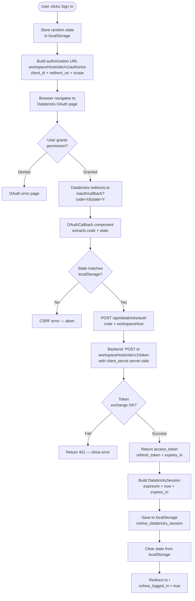

---

## 3. Enter Hex Setup

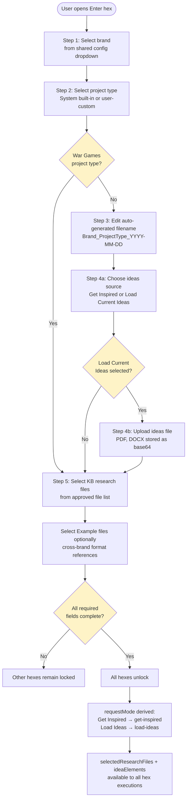

---

## 4. Persona Hex Flow (Luminaries / Consumers / Colleagues / Cultural)

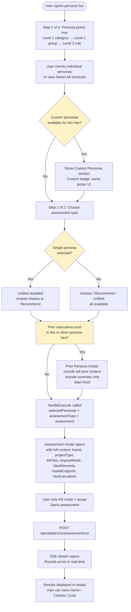

---

## 5. Grade Hex Flow

```mermaid
flowchart TD
    A([User opens Grade hex]) --> B[Step 1: Ideas extracted automatically\nfrom all prior hex discussions]
    B --> C[Ideas displayed as checkboxes\nall checked by default]
    C --> D[User unchecks to exclude\nor types to add manually]
    D --> E{At least 1 idea\nselected?}
    E -- No --> D
    E -- Yes --> F[Step 2: Segment picker\nLifestyle / Demographic / Psychographic hierarchy]
    F --> G[User selects target segments\npopulation % shown per segment]
    G --> H{At least 1 segment\nselected?}
    H -- No --> G
    H -- Yes --> I[Step 3: Choose scoring scale\n1-5 written / 1-5 scores only\n1-10 written / 1-10 scores only\nWritten only]
    I --> J[Zappi Questions toggle\ndefault OFF]
    J --> K{Include Zappi\nQuestions?}
    K -- Yes --> L[7 concept-testing questions per\nidea × segment: Brand Fit, Standout,\nEmotion, Relevance, Understanding,\nPurchase Intent, Brand Appeal\nAll 1-5 same direction]
    K -- No --> M
    L --> M[Run Scoring clicked\ngradeAssessment encoded:\nGRADE_SCALE + GRADE_IDEAS\n+ optional ZAPPI_QUESTIONS:true]
    M --> N[POST /api/databricks/assessment/run\nassessmentTypes = grade\nselectedPersonas = segment IDs]
    N --> O[run.js parses markers\nbuilds scoring + optional Zappi prompt]
    O --> P[Each segment scores each idea\nfrom segment persona perspective]
    P --> Q[Score grid returned\nideas × segments with populations]
    Q --> R{Written assessments\nrequested?}
    R -- Yes --> S[One paragraph per idea × segment pair]
    R -- No --> T
    S --> T[Zappi responses section\nif toggle was ON]
    T --> U[Results appended to iteration file\nGrade: Score Grid + Grade: Written Assessments]

    style E fill:#fef3c7
    style H fill:#fef3c7
    style K fill:#fef3c7
    style R fill:#fef3c7
```

---

## 6. Assessment Pipeline (run.js)

```mermaid
flowchart TD
    A([POST /api/databricks/assessment/run]) --> B[Parse markers from userSolution:\nPRIOR_PERSONAS, PRIOR_SUMMARY,\nWAR_GAMES_COMPETITOR, ZAPPI_QUESTIONS]
    B --> C[Resolve credentials:\nenv vars preferred over OAuth token]
    C --> D[Fetch KB file content\nfrom Databricks volumes\ncapped at 80KB per file]
    D --> E[Fetch prior gems\nfor this brand + hex\nfrom gems table]
    E --> F[Build combinedSignals block\nKB gems + iteration signals\n+ prior persona context\n+ user directions]
    F --> G[Build iterationContextBlock\nfrom prior hex results this session]
    G --> H[Resolve projectTypePrompt\nuser-defined → system defaults → generic]
    H --> I[Load persona data\ncustom- prefix → customPersonaData\nbuilt-in → getPersonaContent]
    I --> J[Shuffle persona order\nto prevent anchoring]
    J --> K[Setup SSE headers\nbegin streaming]

    K --> L[Round 0: Moderator Opening\nsession objective, rules,\n3 sharp questions]
    L --> M[Stream round 0 to frontend]

    M --> N[Round 1: Parallel persona fire\nPromise.all across all personas]
    N --> O[Each persona: identity block\n+ KB context + task description\n+ mode block + rules]
    O --> P[Stream round 1 to frontend]

    P --> Q{numDebateRounds > 0\nAND more than 1 persona\nAND not War Games?}
    Q -- Yes --> R[Moderator Recap\n1 sentence per persona\ntensions + unchallenged claims]
    R --> S[Debate round: re-shuffled order\neach persona sees full prior transcript\nchallenge others by name]
    S --> T[Stream debate round to frontend]
    T --> U{More debate\nrounds?}
    U -- Yes --> R
    U -- No --> V
    Q -- No --> V

    V[Fact-Checker round\naudit all citations vs kbFileNames\nflag hallucinations]
    V --> W[Stream fact-checker to frontend]

    W --> X[Moderator Synthesis\nall-transcript closing\ndecisive recommendation]
    X --> Y[Stream synthesis to frontend]

    Y --> Z[Neutral Summarizer\nnever sees system prompt or KB\naccurate concise summary]
    Z --> AA[Extract cited filenames\nincrement citation_count in DB]
    AA --> AB[logAssessment to activity_log]
    AB --> AC[Stream complete event\nwith citedFiles + summary + durationMs]

    style Q fill:#fef3c7
    style U fill:#fef3c7
```

---

## 7. Knowledge Base: Upload & Process Flow

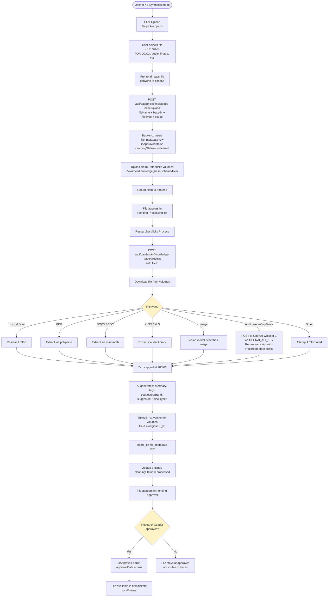

---

## 8. Custom Personas: Create / Edit / Delete


---

## 9. Findings Hex: Save & Summarize

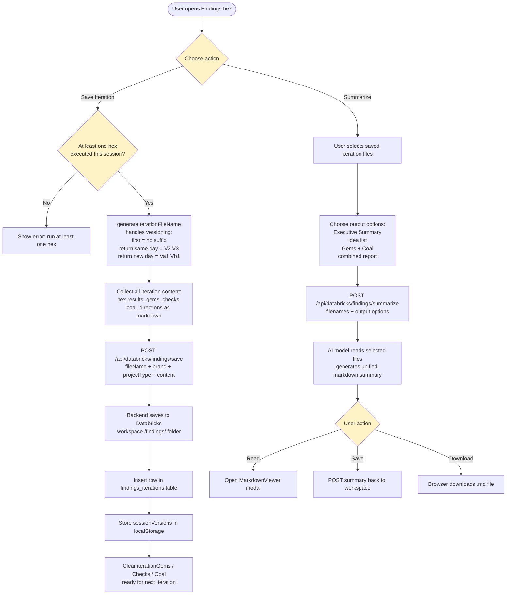

---

## 10. Wisdom Hex: All Input Methods

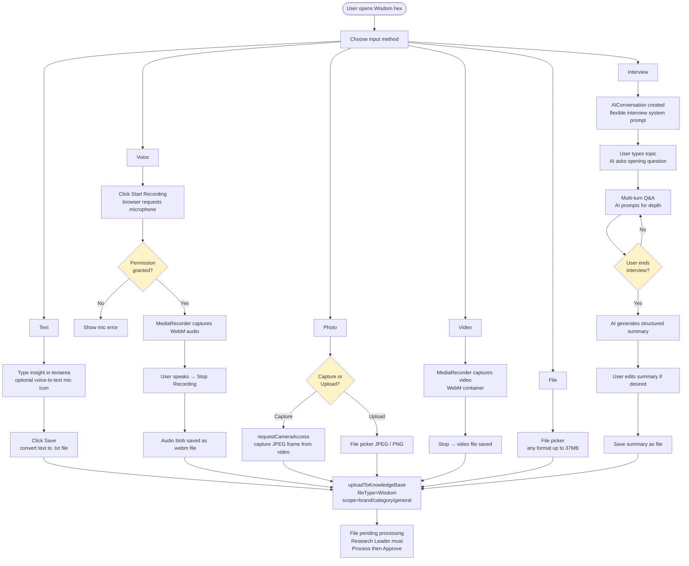

---

## 11. AI Help Widget Flow

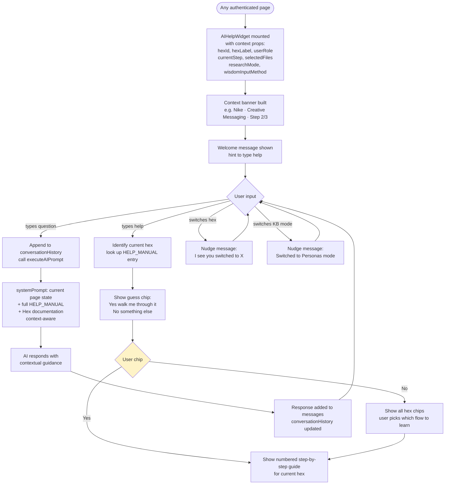

---

## 12. Iteration Signals: Gems / Checks / Coal

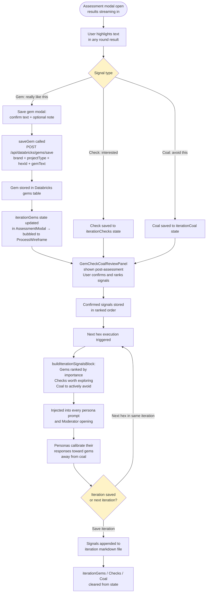

---

## 13. War Games Special Flow

```mermaid
flowchart TD
    A([User selects War Games\nin Enter hex]) --> B[Ideas Source + Ideas File\nhidden — War Games always generative]
    B --> C[Only KB Research Files\nselected in Enter hex]
    C --> D[Enter complete → all hexes unlock]

    D --> E[User opens Competitors hex]
    E --> F[Step 1: Type competitor brand name\ne.g. Coca-Cola]
    F --> G{War Games mode\nauto-detected}
    G --> H[Analysis Type dropdown hidden\nprompt: Describe scenario or strategic question]
    H --> I[User types scenario optional\ne.g. Competitor launching RTD in our core SKU]
    I --> J[Click Execute\nWAR_GAMES_COMPETITOR: name\ninjected into assessment field]

    J --> K[POST /api/databricks/assessment/run\nprojectType = War Games\nassessmentType = unified\nselectedPersonas = empty]
    K --> L[run.js detects War Games\nskips persona debate framework]
    L --> M[projectTypePrompt: 5-step\nWar Games framework\n1. Brand Offensive + Defensive moves\n2. Competitor Reactions to Step 1\n3. Competitor Independent moves\n4. Brand Responses to Step 3\n5. Summary Priority Likelihood]
    M --> N[warGamesCompetitorBlock prepended:\nexact brand and competitor names\nused throughout all 5 steps]
    N --> O[Moderator frames session\nwith competitive framing]
    O --> P[Single unified AI call\nor minimal rounds — no persona debate]
    P --> Q[5-step analysis returned]
    Q --> R[Moderator synthesis:\ndecisive competitive strategy]
    R --> S[Results streamed to AssessmentModal]

    S --> T[User can run again\nwith different competitor]
    T --> U[Each execution saved\nin hexExecutions competitors]
    U --> V[Prior executions shown\nin Competitors history]

    style G fill:#fef3c7
```

---

## 14. Full System Overview

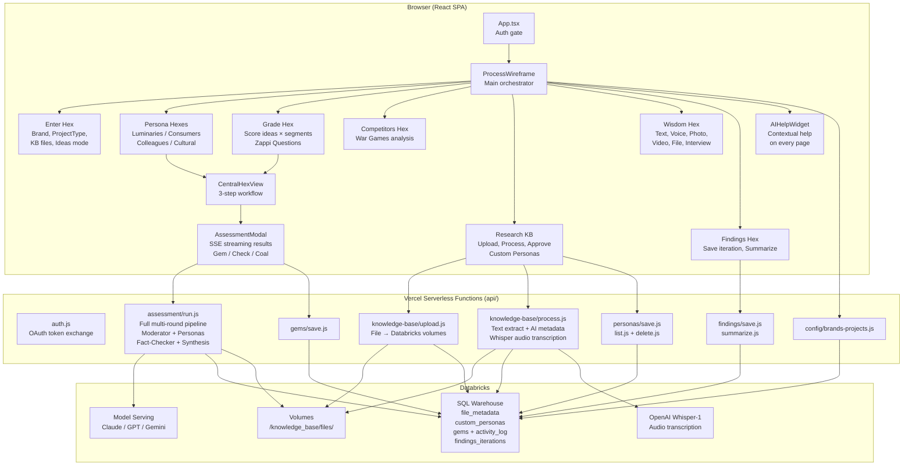

---

*Generated from CoHive codebase — May 2026*
